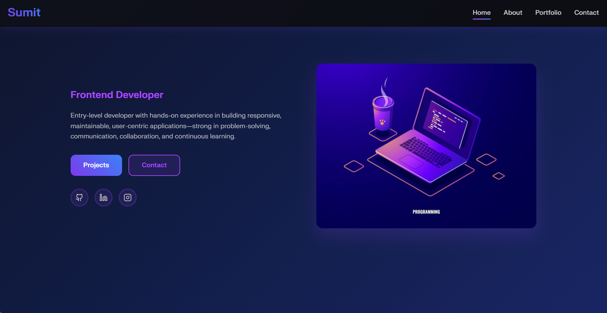

# Sumit Kumar Naik — Portfolio

A modern, responsive developer portfolio built with **React**, **TypeScript**, **Vite**, and **Tailwind CSS**. Showcasing projects, certifications, and technical skills with smooth animations and a clean, accessible design.



---

## ✨ Features

- **Responsive Design:** Looks great on all devices.
- **Animated UI:** Powered by [Framer Motion](https://www.framer.com/motion/) for smooth transitions.
- **Project & Certificate Showcase:** Highlight your work and achievements.
- **Tech Stack Gallery:** Display your technical skills visually.
- **Contact Form:** Animated, accessible contact form.
- **Section Navigation:** Smooth scroll and active section highlighting.
- **Custom Hooks:** For scroll-based animations and navigation.
- **Dark Theme:** Modern, dark-themed UI.

---

## 🚀 Demo

**Live Demo:** [link](https://my-portfolio-sumit.vercel.app/)  
Or run locally (see below).

---

## 🛠️ Tech Stack

- [React](https://react.dev/)
- [TypeScript](https://www.typescriptlang.org/)
- [Vite](https://vitejs.dev/)
- [Tailwind CSS](https://tailwindcss.com/)
- [Framer Motion](https://www.framer.com/motion/)
- [Lucide Icons](https://lucide.dev/)
- [React Router](https://reactrouter.com/)

---

## 📦 Getting Started

### Prerequisites

- [Node.js](https://nodejs.org/) (v18+ recommended)
- [npm](https://www.npmjs.com/) or [yarn](https://yarnpkg.com/)

### Installation

```sh
git clone https://github.com/Funtasti/my-portfolio.git
cd my-portfolio
npm install
```

### Development

```sh
npm run dev
```

Open [http://localhost:5173](http://localhost:5173) to view in your browser.

### Production Build

```sh
npm run build
```

### Linting

```sh
npm run lint
```

---

## 🗂️ Project Structure

```
my-portfolio/
├── public/              # Static assets
├── src/
│   ├── assets/          # Images, icons, resume
│   ├── components/      # Reusable UI components (Navbar, Hero, StatusCard, etc.)
│   ├── data/            # Portfolio/project/certificate data
│   ├── hooks/           # Custom React hooks
│   ├── pages/           # Main page sections (Home, About, Portfolio, Contact, etc.)
│   ├── utils/           # Utility functions (smooth scroll, etc.)
│   └── App.tsx          # Main app component
├── index.html
├── package.json
└── ...
```

---

## ✍️ Customization

- **Projects/Certificates:**  
  Edit [`src/data/portfolio.ts`](src/data/portfolio.ts) to add your own projects, certificates, and tech stack.

- **Profile Info:**  
  Update content in [`src/pages/AboutDetail.tsx`](src/pages/AboutDetail.tsx) and [`src/components/Hero.tsx`](src/components/Hero.tsx).

- **Images/Resume:**  
  Place your images and resume in [`src/assets/`](src/assets/).

---

## 📄 License

This project is open source and available under the [MIT License](LICENSE).

---

## 🙋‍♂️ Author

**Sumit Kumar Naik**  
[GitHub](https://github.com/Funtasti) | [LinkedIn](https://www.linkedin.com/in/sumit-kumar-naik)

---

> _Built with passion and code. Feel